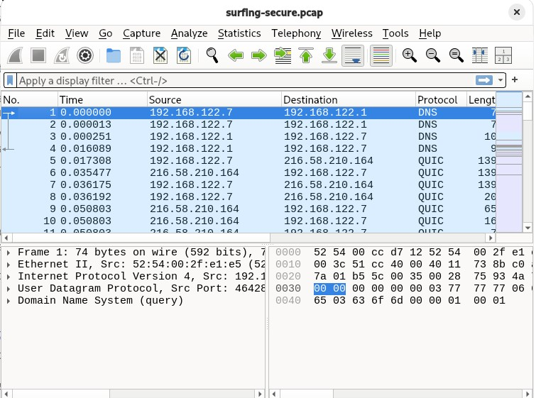

# h1 Kybertappoketju

## x)

## a)

## b)

## c)

nmap on porttiskannaaja
-T4 on agressiivisempi skannaus 
localhost on oma kone
-A tarkempi skannaus. Yrittää tunnistaa esim käyttöjärjestelmän ja porteissa toimivat palvelut
127.0.0.1 on localhost
1000 closed tcp ports --> tuhat porttia oli suljettuna

## d)

## e)
