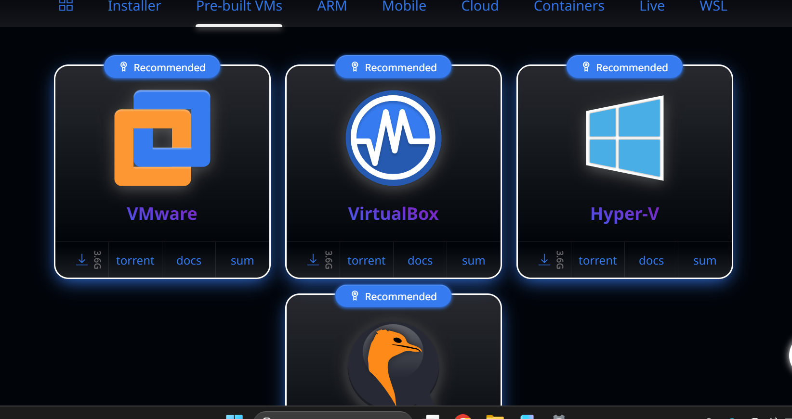
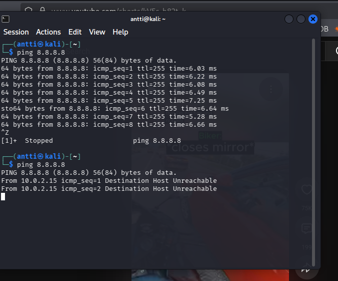
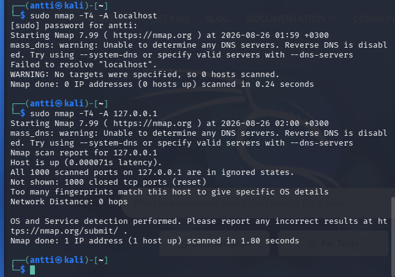

# h1 Kybertappoketju

## x)

## a)
Latasin kalin ensimmäistä kertaa

- Kokeilin ladata valmiin, mutta en saanut virtual disk imagea toimimaan
- Lopulta lisäsin sen manuaalisesti virtualboxiin lataamalla vain ISO:n, joka oli todella helppoa.
- Setuppasin sen ja aloin tekemään tehtäviä

## b)

- Kuvassa näkyy netti kytkettynä ja irrotettuna

## c)

nmap on porttiskannaaja
-T4 on agressiivisempi skannaus 
localhost on oma kone
-A tarkempi skannaus. Yrittää tunnistaa esim käyttöjärjestelmän ja porteissa toimivat palvelut
127.0.0.1 on localhost
1000 closed tcp ports --> tuhat porttia oli suljettuna

## d)

## e)
