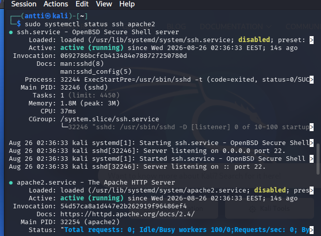
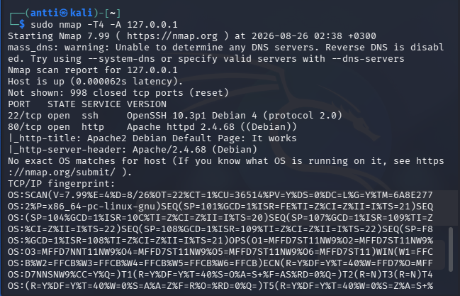

# Kybertappoketju

## x) Aineistojen tiivistelmät

### 1. Darknet Diaries / Herrasmieshakkerit – [jakson nimi]

- 
- 
- 
- 

### 2. Hutchins et al. (2011) – Intrusion Kill Chain

- 
- 
- 
- 

### 3. The Art of Hacking – Active Reconnaissance

- 
- 
- 
- 

### 4. KKO 2003:36

- 
- 
- 
- 

## a) Kali Linuxin asennus

Asensin Kali Linuxin VirtualBox-virtuaalikoneeseen.

Asennuksessa:
- Kokeilin ensin valmista VirtualBox-imagea, mutta virtuaalilevy ei toiminut.
- Tämän jälkeen latasin Kali Linuxin ISO-tiedoston ja asensin sen manuaalisesti VirtualBoxiin.
- Asennettu versio: **Kali Linux 2026.2**

---

## b) Virtuaalikoneen irrottaminen verkosta

Irrotin Kali-virtuaalikoneen verkosta VirtualBoxin verkkoasetuksista.

Testasin yhteyden komennolla:

`ping 8.8.8.8`

Testi osoitti, ettei virtuaalikone saanut enää yhteyttä Internetiin.

---

## c) Porttiskannaus

Suoritin porttiskannauksen komennolla:

`sudo nmap -T4 -A 127.0.0.1`

Komennon parametrit:

- **nmap** – porttiskannaustyökalu.
- **-T4** – nopeuttaa skannausta ja on agressiivisempi.
- **-A** – tekee tarkemman skannauksen ja yrittää tunnistaa esimerkiksi käyttöjärjestelmän ja palvelut.
- **127.0.0.1** – localhost eli oma kone.

### Tulosten analysointi

Nmap ilmoitti:

`Not shown: 1000 closed tcp ports`

Tämä tarkoittaa, että kaikki skannatut **1000 yleisintä TCP-porttia olivat suljettuja**. Koneessa ei siis ollut näissä porteissa kuuntelevia palveluita skannauksen aikana.

---

## d) Kahden demonin asennus ja uusi porttiskannaus

Asensin kaksi demonia: **OpenSSH-serverin** ja **Apache2:n**.

Tarkistin demonien tilan komennolla:

`sudo systemctl status ssh apache2`

Molemmat palvelut olivat **active (running)**, eli ne olivat käynnissä.

Tämän jälkeen suoritin saman porttiskannauksen uudelleen:

`sudo nmap -T4 -A 127.0.0.1`

Skannauksen tuloksena:

- **998 TCP-porttia oli suljettu**
- **22/tcp oli avoinna** – portissa toimii SSH-palvelu (OpenSSH)
- **80/tcp oli avoinna** – portissa toimii HTTP-palvelu (Apache2)

## Tekoälyn käyttö

Käytin ChatGPT:tä apuna raportin rakenteessa ja muotoilussa.
