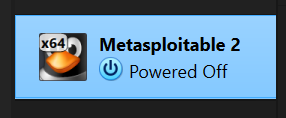
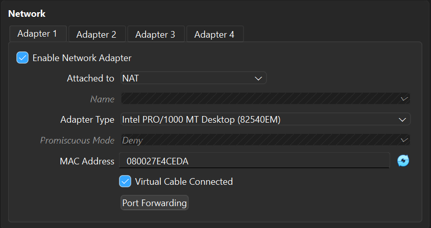
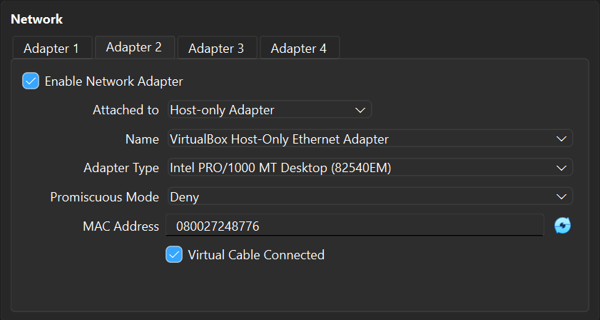
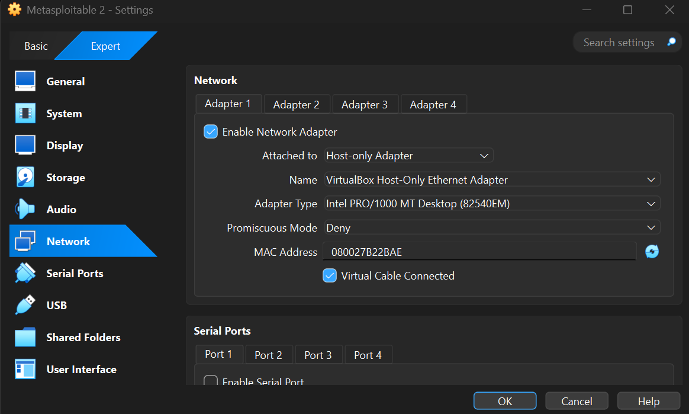
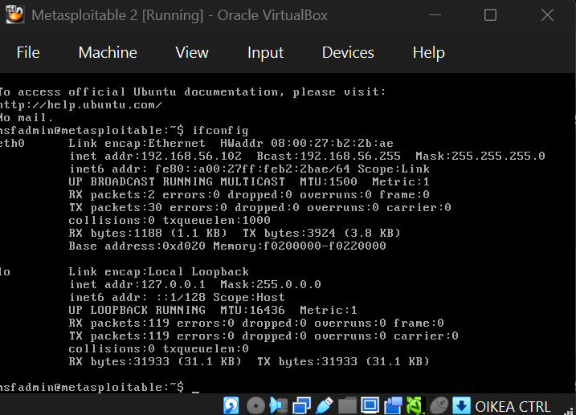
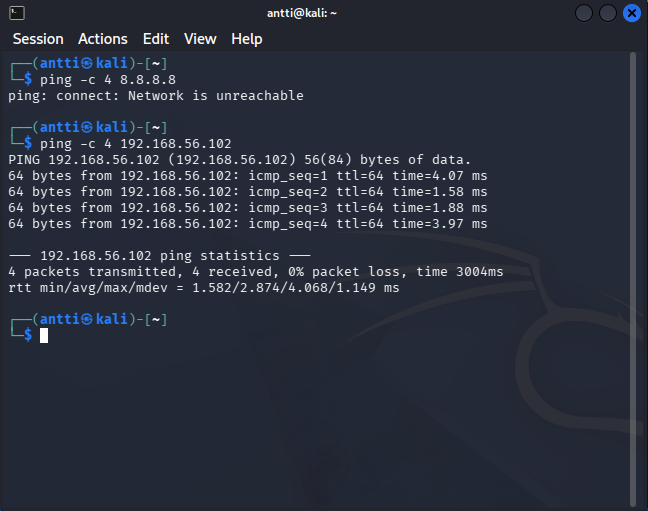
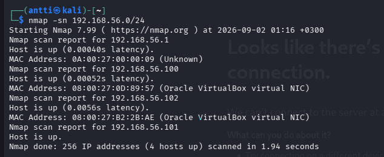
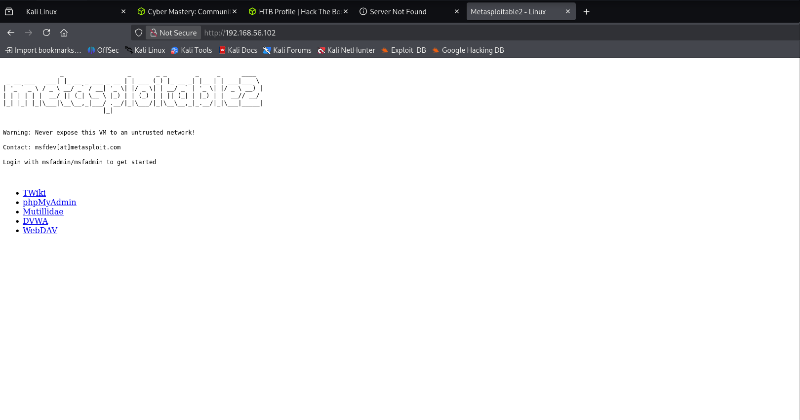
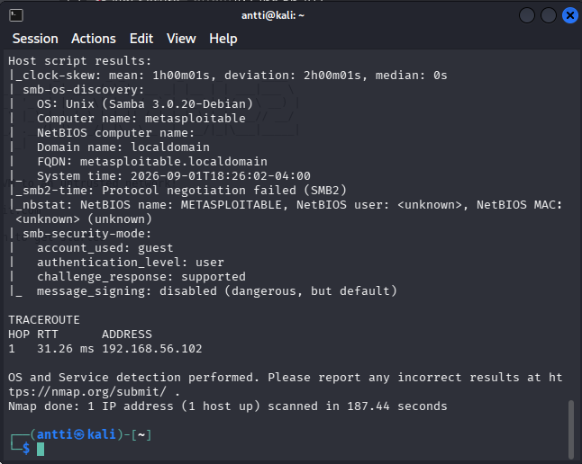
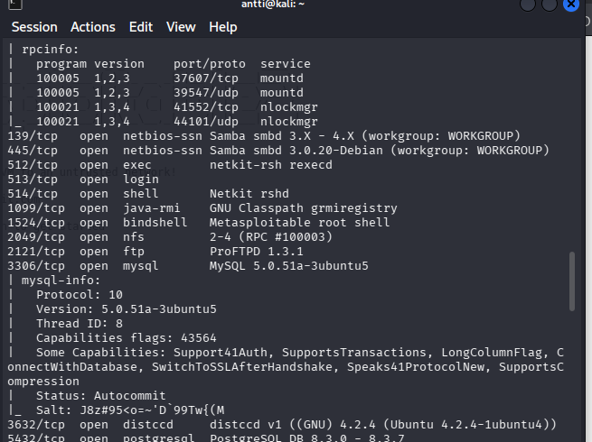

# h2 DORA the Explora

## x) 

### Buuri 2026: DORA and TLPT testing - Lecture for Haaga-Helia on 31 March 2026 (pdf, 2 MB)

- TIBER on framework red team testaukseen
- Hyökkäyksissä voidaan antaa legup, jolloin red teamille annetaan esim. jokin tunnus jolla ohittaa vaihe, jossa voisi jäädä kiinni.

### DORA (Regulation ... on digital operational resilience for the financial sector)

- TLPT-testauksessa jäljitellään oikeaa kyberhyökkystä.
- Testaajat ovat osaavia ja luotettavia.

### TIBER-FI procedures and guidelines 

- On ennalta määritellyt kohteet, joita halutaan testata.
- Red Team jäljittelee oikeaa hyökkääjää.

### 

## a) Asenna Metasploitable 2 virtuaalikoneeseen.

- Ram: 1024mb
- cpu: 1

## b)  Tee Kalin ja Metasploitablen välille virtuaaliverkko.

- Kali adapter 1

- kali adapter 2

- metasploitable adapteri

## c)  

- Metasploitablen ifconfig

- Kali ei pääse nettiin, mutta yhteys metasploitableen onnistuu

## d) 

- nmap löysi metasploitable ip:n

- Sivu avautui selaimessa

## e) 

