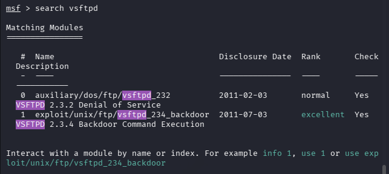
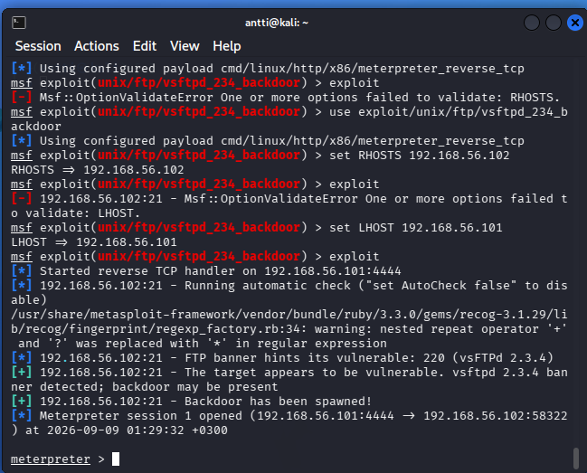
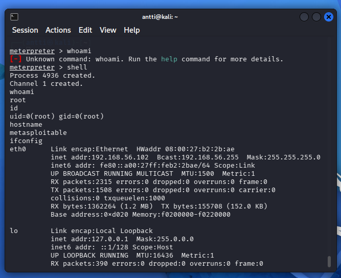
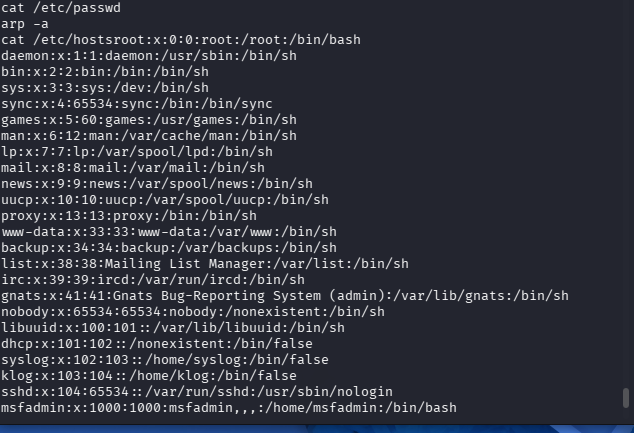
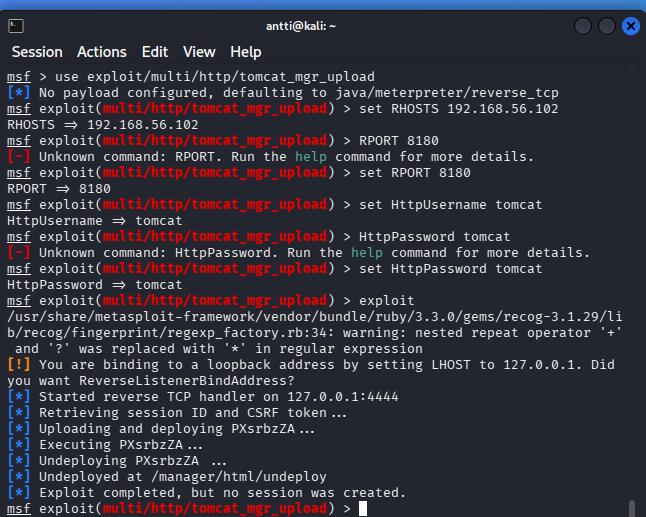

# H3 EternalHomework

## x)

### Jaswal 2020: Mastering Metasploit - 4ed

Chapter 1: Approaching a Penetration Test Using Metasploit  
(kohdasta Conducting a penetration test with Metasploit luvun loppuun eli "Summary" loppuun)

- Metaploittia käytetään järjestelmien haavoittuvuuksien testaamiseen
- pen testauksessa kerätään tietoa ja niitä hyödyntäen testataan heikkouksia

### Mitä `nmap -sn` tekee?

- Selvittää mitkä kohdeverkon laitteet ovat aktiivisia.
- `-sn` meinaa että ei portti skannausta, eli se etsii vain aktiiviset laitteet.

---

## b)


*Kuva 1. Metasploit käynnissä ja yhteys PostgreSQL-tietokantaan toimii.*


*Kuva 2. Metasploitable-koneen palveluiden kartoitus `db_nmap`-komennolla.*


*Kuva 3. Metasploitin tietokantaan tallennetut palvelut.*

---

## c)

```text
msf > services
Services
========

host       port  proto  name         state  info
----       ----  -----  ----         -----  ----
192.168.56.102  21    tcp    ftp          open   vsftpd 2.3.4
192.168.56.102  22    tcp    ssh          open   OpenSSH 4.7p1
192.168.56.102  23    tcp    telnet       open   Linux telnetd
192.168.56.102  25    tcp    smtp         open   Postfix smtpd
192.168.56.102  53    tcp    domain       open   ISC BIND 9.4.2
192.168.56.102  80    tcp    http         open   Apache httpd 2.2.8
192.168.56.102  111   tcp    rpcbind      open   RPC
192.168.56.102  139   tcp    netbios-ssn  open   Samba
192.168.56.102  445   tcp    netbios-ssn  open   Samba
192.168.56.102  512   tcp    exec         open   netkit-rsh rexecd
192.168.56.102  513   tcp    login        open   rlogind
192.168.56.102  514   tcp    shell        open   Netkit rshd
192.168.56.102  1099  tcp    java-rmi     open   GNU Classpath
192.168.56.102  1524  tcp    bindshell    open   Metasploitable root shell
192.168.56.102  2049  tcp    nfs          open   NFS
192.168.56.102  2121  tcp    ftp          open   ProFTPD 1.3.1
192.168.56.102  3306  tcp    mysql        open   MySQL 5.0.51a
192.168.56.102  5432  tcp    postgresql   open   PostgreSQL
192.168.56.102  5900  tcp    vnc          open   VNC
192.168.56.102  6000  tcp    x11          open   access denied
192.168.56.102  6667  tcp    irc          open   UnrealIRCd
192.168.56.102  8009  tcp    ajp13        open   Apache Jserv
192.168.56.102  8180  tcp    http         open   Apache Tomcat
```

Palveluita voidaan myös suodattaa esimerkiksi portin perusteella:

```text
msf > services -p 80

host            port  proto  name  state  info
----            ----  -----  ----  -----  ----
192.168.56.102  80    tcp    http  open   Apache httpd 2.2.8 (Ubuntu) DAV/2
```

- Tuloksessa näkyy siis tcp http open ja apache, kun suodatin vain portin 80.

---

## d)



*Kuva 4. Metasploitin `search vsftpd` löytää VSFTPD 2.3.4 Backdoor -exploitin.*

- VSFTPD 2.3.4 Backdoor
- Kyseiseen version lähdekoodiin oli lisätty takaovi

---

## e)

- `-oA`: Parempi tallentamiseen ja siirtämiseen. `.nmap` hyvä tekstimuodossa ja `.xml` voi käsitellä esim. muilla ohjelmilla
- `db_nmap`: käsittelee tuloksia paremmin metasploitablessa

---

## f)



*Kuva 5. VSFTPD 2.3.4 -palvelun hyödyntäminen Metasploitilla. Hyökkäyksen jälkeen Meterpreter-istunto avautui.*

- Näillä komennoilla pääsin automaattisesti sisälle.
- seurasin tätä ohjetta: https://medium.com/@r62138808/one-smiley-face-one-root-shell-the-vsftpd-2-3-4-backdoor-in-metasploitable-2-9211680b2412

---

## g)



*Kuva 6. Meterpreter-istunnosta avattiin shell ja tarkistettiin käyttäjä, hostname sekä verkkotiedot.*



*Kuva 7. Kohdekoneen `/etc/passwd`-tiedoston sisältöä tarkasteltiin käyttäjätietojen selvittämiseksi.*

---

## h)



*Kuva 8. Apache Tomcat Manager -moduulin asetukset Metasploitissa. Kohteena portti 8180 ja käytössä Tomcatin oletustunnukset.*

https://www.infosectrain.com/blog/metasploitable-2-exploitation-walkthrough

---

## i)

en saanut auki 6200, sillä oli cooldown??


*Kuva 9. VSFTPD:n backdoor-yhteyden muodostaminen porttiin 6200 epäonnistui.*

---

## j) Kesken!

---

## k) Kesken!

---

## l) Attaaack!

Harjoituksessa käytin seuraavia MITRE ATT&CK -taktiikoita ja tekniikoita:

- **Active Scanning (T1595)**
  - Skannasin Metasploitablea Nmapilla ja etsin avoimia portteja.

- **Network Service Discovery (T1046)**
  - Selvitin, mitä palveluita avoimissa porteissa oli käynnissä.

- **Exploit Public-Facing Application (T1190)**
  - Hyödynsin haavoittuvaa vsftpd-palvelua päästäkseni kohdekoneelle.

- **Valid Accounts (T1078)**
  - Kirjauduin Tomcat Manageriin oletustunnuksilla `tomcat:tomcat`.

- **Command and Scripting Interpreter (T1059)**
  - Pääsyn saamisen jälkeen pystyin suorittamaan komentoja kohdekoneella.

---

## Lähteet

- https://www.rapid7.com/db/modules/exploit/unix/ftp/vsftpd_234_backdoor/
- https://medium.com/@r62138808/one-smiley-face-one-root-shell-the-vsftpd-2-3-4-backdoor-in-metasploitable-2-9211680b2412
- https://www.infosectrain.com/blog/metasploitable-2-exploitation-walkthrough

## Tekoälyn käyttö

Käytin ChatGPT:tä raportin muotoilun ja rakenteen selkeyttämiseen. 
