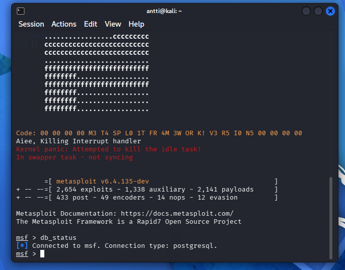
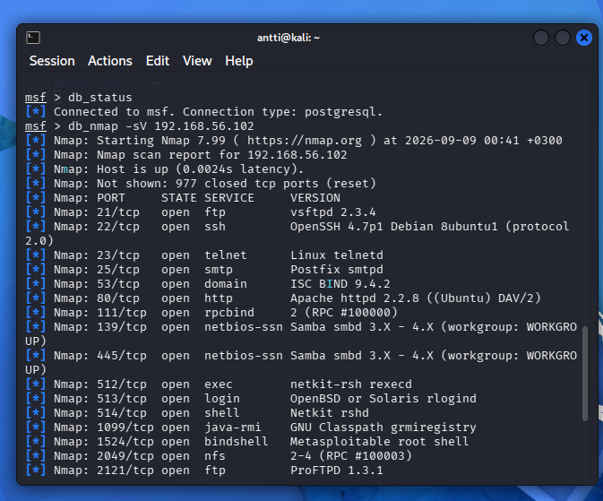
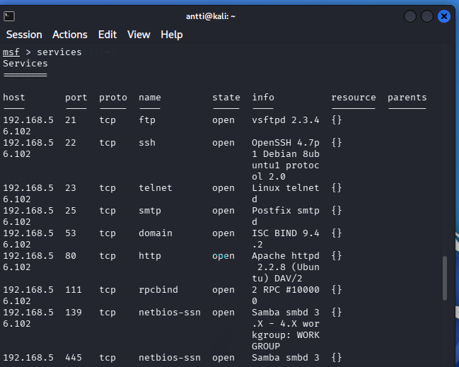

#h3 EternalHomework

## x)
€ Jaswal 2020: Mastering Metasploit - 4ed: Chapter 1: Approaching a Penetration Test Using Metasploit (kohdasta Conducting a penetration test with Metasploit luvun loppuun eli "Summary" loppuun)
- Metaploittia käytetään järjestelmien haavoittuvuuksien testaamiseen
- pen testauksessa kerätään tietoa ja niitä hyödyntäen testataan heikkouksia

Mitä 'nmap -sn' tekee?
- Selvittää mitkä kohdeverkon laitteet ovat aktiivisia. -sn meinaa että ei portti skannausta, eli se etsii vain aktiiviset laitteet.'

## b)

  
  
  
