# h4 Täysin Laillinen Sertifikaatti

## x) 

 ### OWASP 2021: OWASP Top 10:2021
- Broken access control voi olla, vaikka käyttäjänimen vaihtaminen ja sitä kautta pääseminen salattuun tietoon
- Path traversal hyökkäyksessä voi vaihtaa tiedostopolkua esim. / merkillä joka saattaa avata pääsyn salattuihin tietoihin
- Nämä voi estää käyttöoikeuksilla ja eväämällä pääsy ilman lupaa.

### PortSwigget Academy:
- IDOR liittyy päsynhallintaan voi esim. juurikin vaihtaa käyttäjä id numeron, joka mahdollistaa muiden käyttäjien tietojen näkemisen
- Path traversalilla voi päästä käsiksi esim. lähdekoodiin
- xss avulla hyökkääjä onnistuu lisäämään sivuille omaa javascriptia aiheuttaaseen haittaa

---

## a) Totally Legit Sertificate

Generoin ZAPissa CA-sertifikaatin.

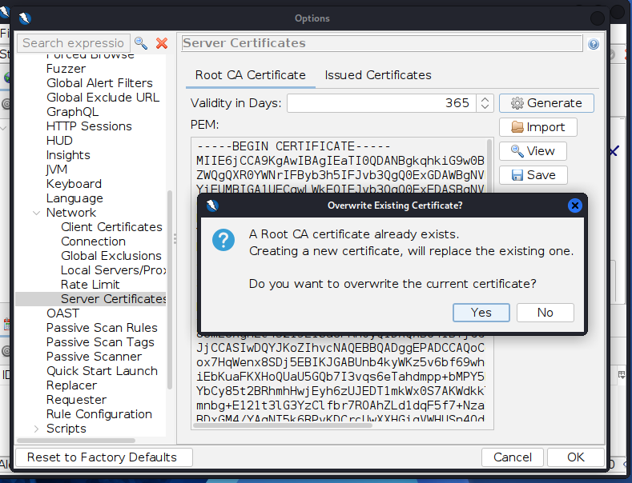

*Kuva 1. ZAPin Root CA -sertifikaatti.*

Tallensin sertifikaatin ja importtasin sen Firefoxiin kohtaan **Authorities**.

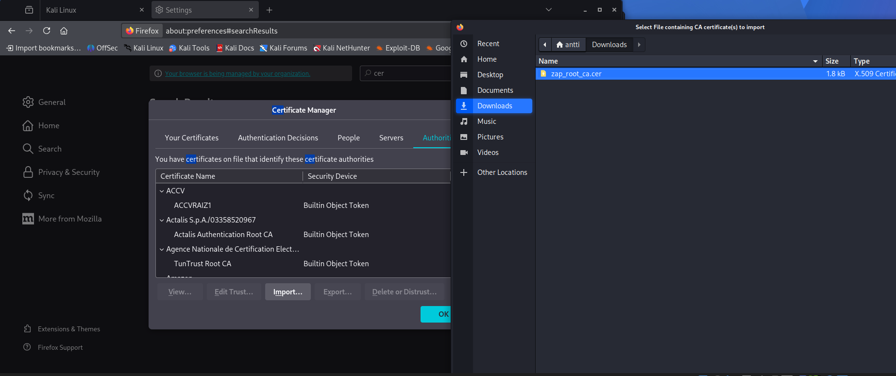

*Kuva 2. ZAPin sertifikaatin tuominen Firefoxiin.*

Asetin Firefoxin proxyksi ZAPin osoitteessa `127.0.0.1:8080`.

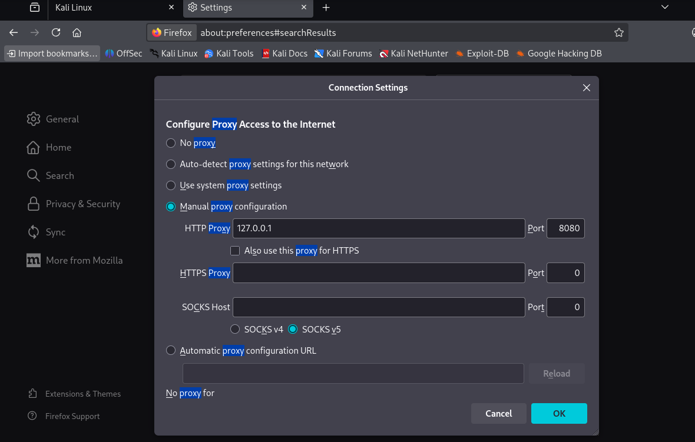

*Kuva 3. Firefoxin proxyasetukset.*

Testasin toimintaa avaamalla sivun selaimessa.

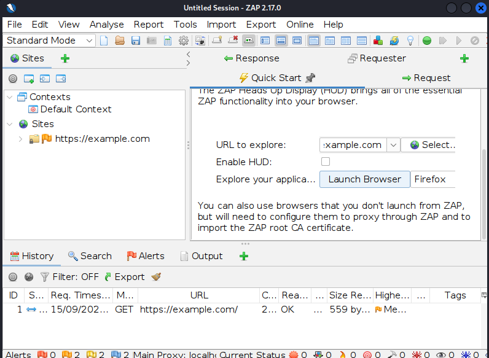

*Kuva 4. Example.comin pyyntö näkyy ZAPissa.*

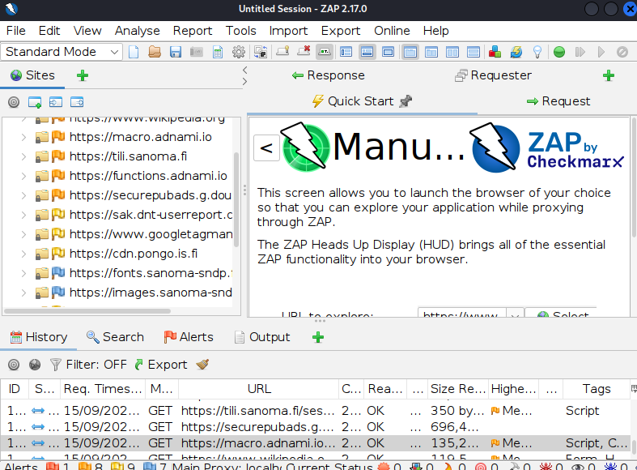

*Kuva 5. Selaimen HTTPS-pyyntöjä näkyy ZAPissa.*

- Proxy toimii, koska selaimen pyynnöt näkyvät ZAPissa.

---

## b) Kettumaista

Asensin Firefoxiin FoxyProxy Standardin ja lisäsin ZAPin proxyksi.

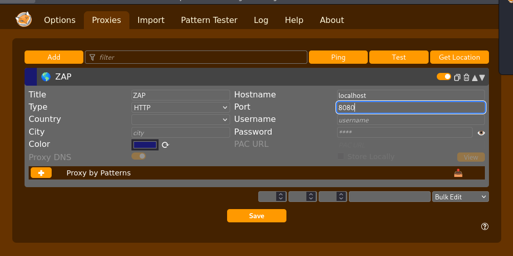

*Kuva 6. ZAP lisättynä FoxyProxyyn portissa 8080.*

Lisäsin Patternseihin PortSwiggerin ja localhostin.

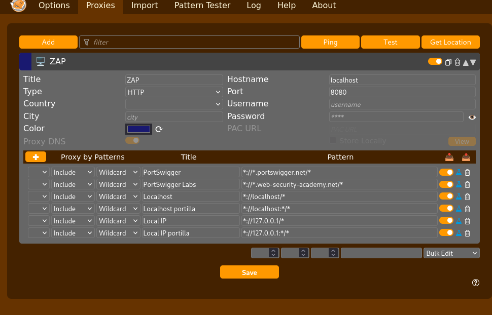

*Kuva 7. FoxyProxyn Patterns-asetukset.*

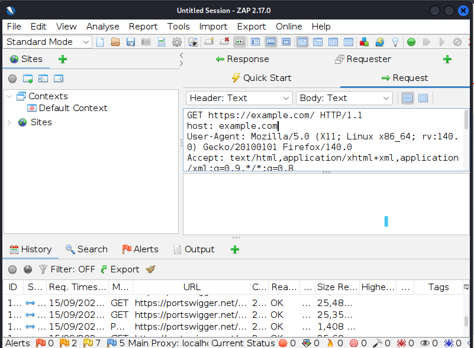

*Kuva 8. PortSwiggerin pyyntö näkyy ZAPissa.*

- Patternsien avulla vain valitut sivut kulkevat ZAPin kautta.

---

## c) Reflected XSS

Syötin hakukenttään:

``

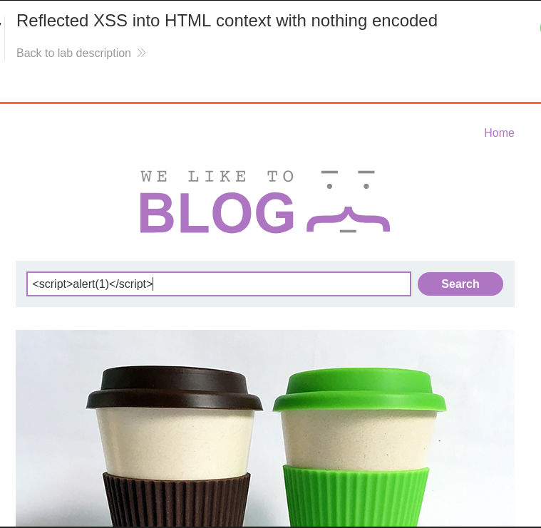

*Kuva 9. XSS-koodi syötettynä hakukenttään.*

- Sivusto palauttaa hakukentän sisällön suoraan HTML:ään.
- Selain tulkitsee ``

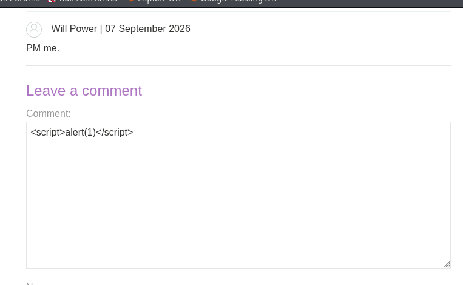

*Kuva 10. XSS-koodi syötettynä kommenttikenttään.*

- Kommentti tallennetaan palvelimelle.
- Kun sivu avataan, tallennettu JavaScript suoritetaan selaimessa.
- Tämä eroaa reflected XSS:stä siinä, että haitallinen koodi jää palvelimelle.
- Vika johtuu siitä, ettei kommentin sisältöä käsitellä turvallisesti.

---

## e) Mitä hyökkääjä hyötyy XSS-hyökkäyksestä?

Koodilla voi päästä käsiksi muiden istuntojen tietoihin esim. toisen selaimen kautta.

---

## f) File path traversal

Tutkin ZAPissa sivun kuvapyyntöä ja huomasin `filename`-parametrin.

Muokkasin sitä näin:

`filename=../../../etc/passwd`

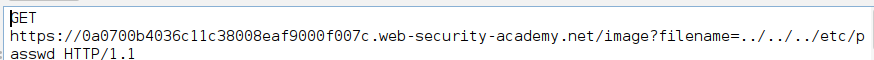

*Kuva 11. Path traversal -pyyntö ZAPissa.*

- `../` siirtyy hakemistossa yhden tason ylöspäin.
- Sen avulla yritin päästä kuvahakemiston ulkopuolelle.
- Palvelimelta pystyi näin pyytämään `/etc/passwd`-tiedostoa.
- Vika johtuu siitä, ettei palvelin tarkista `filename`-parametria tarpeeksi hyvin.

---

## Lähteet

- OWASP Top 10: A01 Broken Access Control
- PortSwigger: Insecure direct object references (IDOR)
- PortSwigger: File path traversal
- PortSwigger: Cross-site scripting

## Tekoälyn käyttö

Käytin ChatGPT:tä raportin muotoilun ja rakenteen selkeyttämiseen.
