# h5 Elokuu2026!

## x)
Karvinen 2022: Cracking Passwords with Hashcat
- hashcatilla voi murtaa salasanoja
- Hashi tyyppi pitää tietää. Rockyou on salasanalista

Karvinen 2023: Crack File Password With John
- Johnilla voi murtaa zip salasanoja
- John voi kokeilla valmiita sanalistoja
- 
## a) Hashcat

Asensin Hashcatin ja tarkistin, että se toimii.

Tunnistin tyypin `hashid`-komennolla. Hashin tyyppi oli MD5, jonka Hashcat mode on 0.

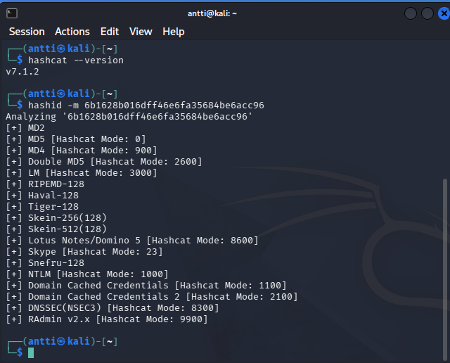

*Kuva 1. Hashcatin toiminnan tarkistus.*

Käytin Hashcatia ja RockYou listaa esimerkkihashin murtamiseen.

Hashcat onnistui murtamaan hashin ja salasanaksi löytyi `summer`.

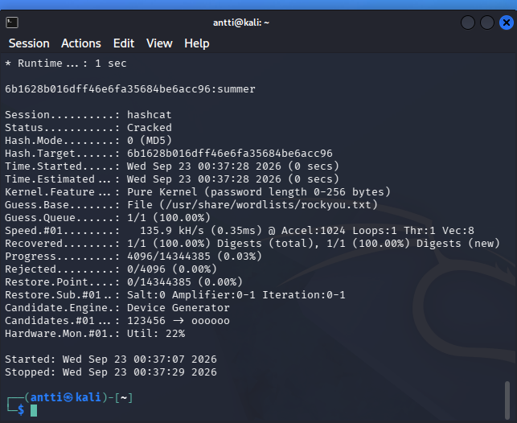

*Kuva 2. Hashcat onnistunut murto.*

## c) John the Ripper

Latasin salasanalla suojatun `tero.zip`-tiedoston.

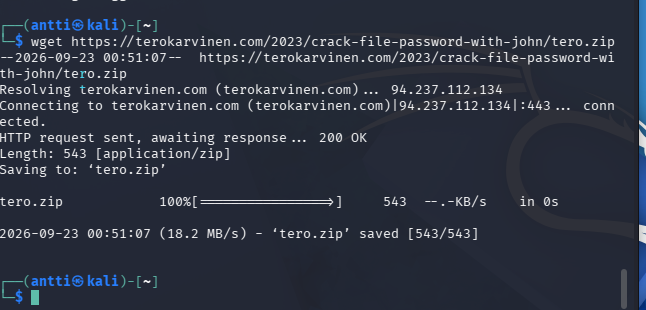

*Kuva 3. ZIP-tiedoston lataus.*

Tein tiedostosta hashin `zip2john`-työkalulla.

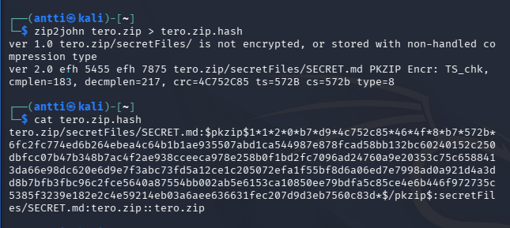

*Kuva 4. Hashin luominen.*

Käytin John the Ripperiä ja RockYou-listaa salasanan murtamiseen. Salasanaksi löytyi `butterfly`.

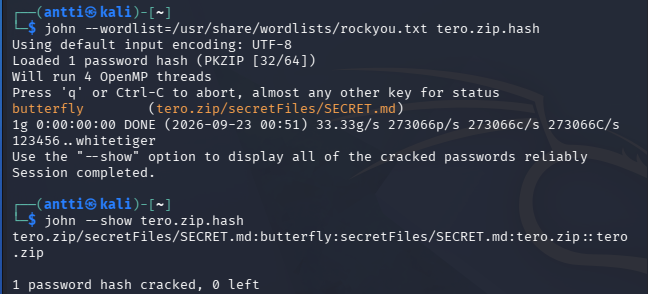

*Kuva 5. Salasana murrettu onnistuneesti.*

## e) Tiedosto

Tein PDF-tiedoston ja suojasin sen salasanalla `hello123`.

Salasin PDF-tiedoston `qpdf`-työkalulla ja tein siitä hashin.

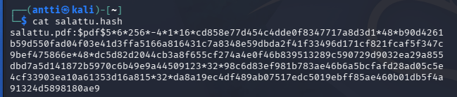

Mursin salasanan John the Ripperillä. Salasanaksi löytyi `hello123`.

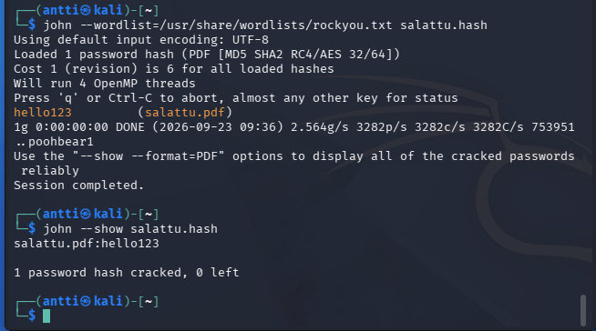

*Kuva. PDF-tiedoston salasana murrettu onnistuneesti.*

## f) Tiiviste

Tein salasanasta `password123` SHA-256-tiivisteen.

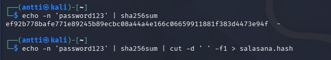

Mursin tiivisteen Hashcatilla ja RockYou-listalla. Salasanaksi löytyi `password123`.

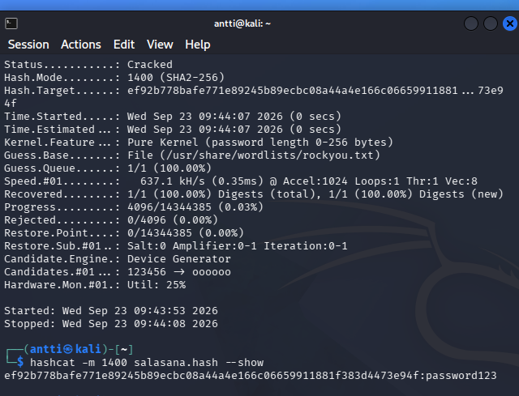

*Kuva. SHA-256-tiiviste murrettu onnistuneesti.*

## g) Sanakirja

Tein oman sanakirjan `vauzaosanat.txt`, johon lisäsin muutaman salasanan.

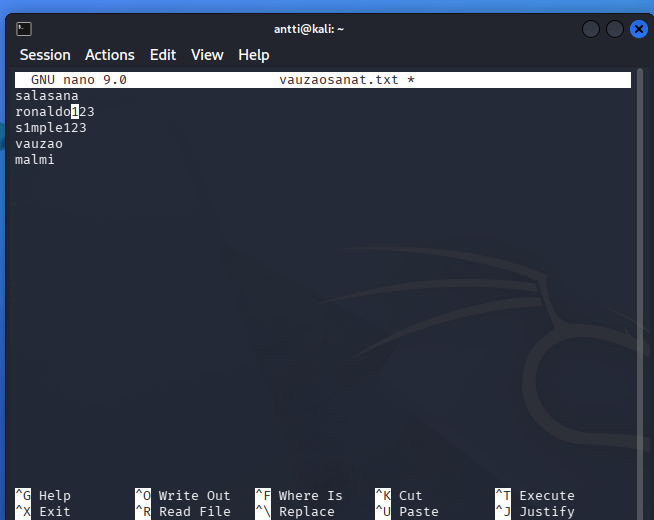

Käytin omaa sanakirjaa Hashcatissa.

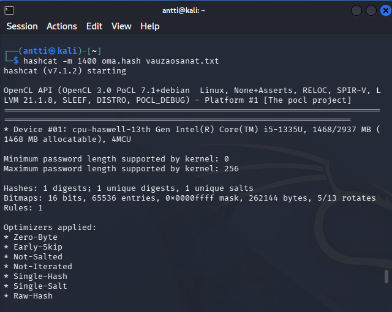

Hashcat löysi salasanaksi `vauzao`.

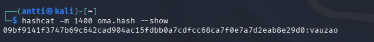

*Kuva. Oman sanakirjan käyttö Hashcatissa.*
