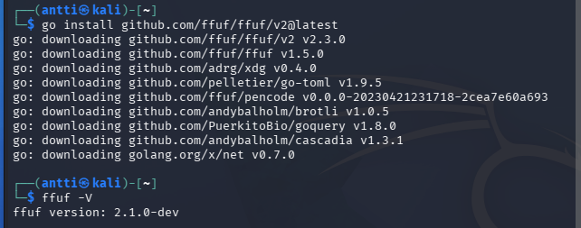
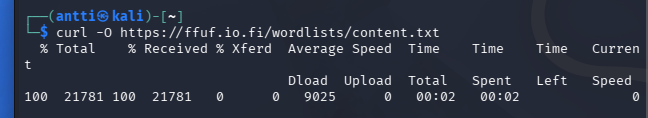
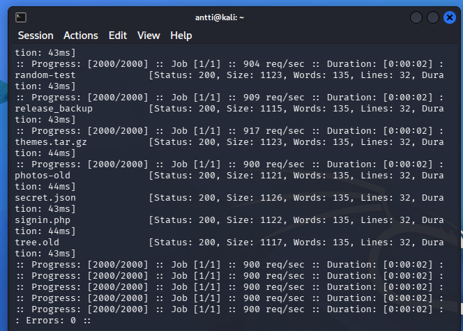
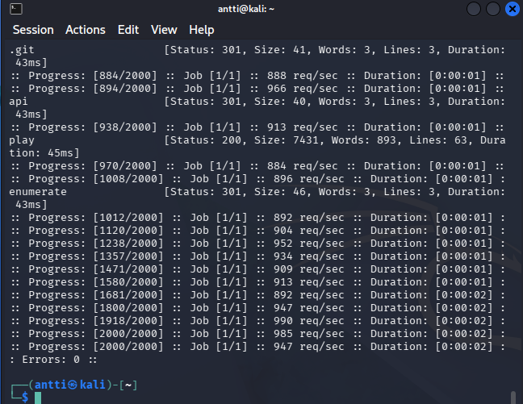

# H6 Fuzzy Feeling Upon Finding
## x

### Hoikkala 2026: Fuzzing with Fuff, kalvot joohoin esityksestä kurssilta.

- FFufissa voi suodattaa mm. hhtp tai vaikkapa sanojen määrän mukaan tuloksia.
- Sanalistat voi määrittää avainsanoilla. Esim url osoitteessa
- -rate, jos haluaa rate limit, eikä turhaan kuluttaa resursseja

## a)
- Scopena on  https://ffuf.io.fi/play. joka on tarkoitettu harjoitusta varten
- Rules of engagement: Pitää tehdä sääntöjen mukaan rajatussa ympäristössä.
- Oikeus testaukseen: Oikeus on tietoturva harjoittelun perusteella. tehtävä antaa luvan.
- Riskit ja mitigointi: Pyynnöt rasittavat palvelemia, eikä niitä kannata tehdä turhaan.

## b) ffuf asennus

Asensin golang-go.

Asensin ffufin uusimman version ja tarkistin version komennolla `ffuf -V`.

## c1) Content discovery

Latasin ensin sanalistan:

`curl -O https://ffuf.io.fi/wordlists/content.txt`

- `curl` = lataa tiedoston netistä
- `-O` = tallentaa tiedoston samalla nimellä
- `content.txt` = sanalista, jota käytetään haussa

Seuraavaksi etsin sivustolta polkuja:

`ffuf -w content.txt -u https://ffuf.io.fi/FUZZ`

- `ffuf` = käynnistää ffufin
- `-w content.txt` = käyttää ladattua sanalistaa
- `-u` = kertoo osoitteen, jota testataan
- `FUZZ` = kohta, johon ffuf kokeilee sanalistan sanoja

Vastauksissa oli 135 sanaa. Suodatin ne pois:

`ffuf -w content.txt -u https://ffuf.io.fi/FUZZ -fw 135`

- `-fw 135` = piilottaa vastaukset, joissa on 135 sanaa

Tämän jälkeen poikkeavat tulokset näkyivät helpommin ja haulla löytyi esimerkiksi `/play`.

